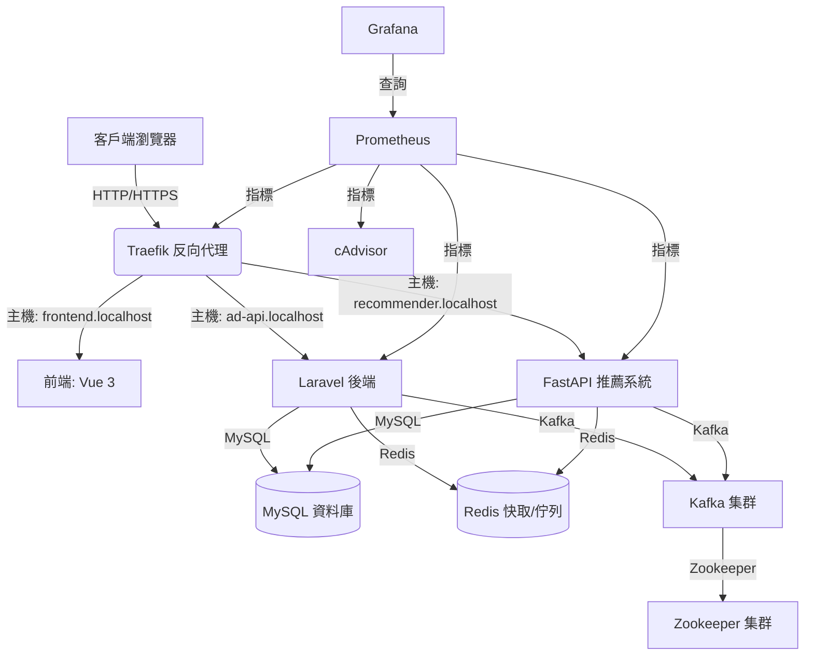

```
# README.md
# AdStackX - 模組化廣告平台

AdStackX 是一個模組化的廣告平台，支援多租戶、個人化推薦和即時數據分析。整合 Laravel 後端、FastAPI 推薦系統和 Vue 3 前端，採用 Docker、Traefik、Kafka、Prometheus 和 Grafana 確保高可用性和監控。

## 專案簡介
- **目的**：提供高效的廣告管理和投放，支援多租戶和個人化推薦。
- **功能模組**：
  - **多租戶**：為不同客戶提供數據隔離。
  - **RBAC**：基於角色的訪問控制，管理權限。
  - **推薦引擎**：根據用戶行為提供個人化廣告。
  - **報表**：追蹤展示次數、點擊率和轉換率。

## 系統架構圖


## 快速啟動指南
### 前置條件
- Docker 和 Docker Compose
- Node.js 18+
- 更新 `/etc/hosts`：
  ```
  127.0.0.1 ad-api.localhost
  127.0.0.1 recommender.localhost
  127.0.0.1 frontend.localhost
  127.0.0.1 traefik.localhost
  ```

### 步驟
1. 複製倉庫：
   ```bash
   git clone https://github.com/BpsEason/ad-platform.git
   cd ad-platform
   ```
2. 配置環境變數：
   ```bash
   cd docker
   cp .env.example .env
   ```
   編輯 `.env`，設置：
   - `DB_PASSWORD`、`DB_ROOT_PASSWORD`（安全密碼）
   - `APP_KEY`（運行 `docker-compose run --rm laravel php artisan key:generate --show`）
   - `TRAEFIK_API_KEY`（隨機生成，例如 `openssl rand -base64 32`）
3. 啟動服務：
   ```bash
   docker-compose up --build -d
   ```
4. 執行遷移和種子數據：
   ```bash
   docker-compose exec laravel php artisan migrate --force && php artisan db:seed --force
   ```
5. 訪問服務：
   - Traefik 儀表板：`http://traefik.localhost:8080`
   - Laravel API：`http://ad-api.localhost/api`
   - FastAPI 文件：`http://recommender.localhost/docs`
   - 前端：`http://frontend.localhost`
   - Grafana：`http://localhost:3000` (admin/admin)

## API 文件
- **Laravel**：`http://ad-api.localhost/api/documentation`（需運行 `php artisan l5-swagger:generate`）
- **FastAPI**：
  - Swagger：`http://recommender.localhost/docs`
  - ReDoc：`http://recommender.localhost/redoc`

## 技術棧與開發工具
- **後端**：Laravel 9.x/10.x (PHP 8.1), MySQL 8.0, Redis 6.2
- **推薦系統**：FastAPI (Python 3.9), Kafka 3.5.1, Zookeeper 3.8.3
- **前端**：Vue 3 (Vite), Node.js 18
- **DevOps**：Docker, Traefik 2.9, Prometheus 2.47.0, Grafana 10.2.2
- **工具**：Composer, PHPUnit, Pytest, Jest, Postman

## 測試方式
- **Laravel (PHPUnit)**：
  ```bash
  docker-compose exec laravel vendor/bin/phpunit
  ```
- **FastAPI (Pytest)**：
  ```bash
  docker-compose exec fastapi pytest
  ```
- **前端 (Jest)**：
  ```bash
  cd frontend
  npm test
  ```

## 安全建議
- **API 密鑰**：為 `TRAEFIK_API_KEY` 生成隨機密鑰，限制端點 IP 訪問。
- **APP_KEY**：使用 `php artisan key:generate` 並儲存在安全位置。
- **租戶驗證**：增強 `SetTenant` 中間件，驗證 `X-Tenant-Id`。
- **其他**：啟用 HTTPS、設置強密碼、實施 API 速率限制。

# docker/docker-compose.yml
version: '3.8'
services:
  traefik:
    image: traefik:v2.9
    container_name: traefik
    ports:
      - "80:80"
      - "8080:8080"
    volumes:
      - ./traefik.yml:/etc/traefik/traefik.yml
      - /var/run/docker.sock:/var/run/docker.sock
    networks:
      - ad_network
  laravel:
    build: ../laravel
    container_name: laravel
    environment:
      - APP_ENV=production
      - APP_KEY=${APP_KEY}
      - DB_HOST=mysql
      - DB_DATABASE=${DB_DATABASE}
      - DB_USERNAME=${DB_USERNAME}
      - DB_PASSWORD=${DB_PASSWORD}
      - REDIS_HOST=redis
    volumes:
      - ../laravel:/var/www/html
      - ./entrypoint.sh:/entrypoint.sh
    depends_on:
      - mysql
      - redis
    networks:
      - ad_network
    labels:
      - "traefik.http.routers.laravel.rule=Host(`ad-api.localhost`)"
  fastapi:
    build: ../fastapi
    container_name: fastapi
    environment:
      - KAFKA_BROKER=${KAFKA_BROKER}
      - REDIS_HOST=redis
      - DB_HOST=mysql
      - DB_NAME=${DB_DATABASE}
      - DB_USER=${DB_USERNAME}
      - DB_PASSWORD=${DB_PASSWORD}
    depends_on:
      - kafka1
      - redis
      - mysql
    networks:
      - ad_network
    labels:
      - "traefik.http.routers.fastapi.rule=Host(`recommender.localhost`)"
  frontend:
    build: ../frontend
    container_name: frontend
    networks:
      - ad_network
    labels:
      - "traefik.http.routers.frontend.rule=Host(`frontend.localhost`)"
  mysql:
    image: mysql:8.0
    container_name: mysql
    environment:
      - MYSQL_ROOT_PASSWORD=${DB_ROOT_PASSWORD}
      - MYSQL_DATABASE=${DB_DATABASE}
      - MYSQL_USER=${DB_USERNAME}
      - MYSQL_PASSWORD=${DB_PASSWORD}
    volumes:
      - mysql_data:/var/lib/mysql
    networks:
      - ad_network
  redis:
    image: redis:6.2
    container_name: redis
    networks:
      - ad_network
  zookeeper1:
    image: confluentinc/cp-zookeeper:7.3.0
    container_name: zookeeper1
    environment:
      ZOOKEEPER_CLIENT_PORT: 2181
      ZOOKEEPER_TICK_TIME: 2000
    networks:
      - ad_network
  kafka1:
    image: confluentinc/cp-kafka:7.3.0
    container_name: kafka1
    depends_on:
      - zookeeper1
    environment:
      KAFKA_BROKER_ID: 1
      KAFKA_ZOOKEEPER_CONNECT: zookeeper1:2181
      KAFKA_ADVERTISED_LISTENERS: PLAINTEXT://kafka1:9092,EXTERNAL://localhost:9094
      KAFKA_LISTENERS: PLAINTEXT://:9092,EXTERNAL://:9094
      KAFKA_OFFSETS_TOPIC_REPLICATION_FACTOR: 2
    ports:
      - "9094:9094"
    networks:
      - ad_network
  prometheus:
    image: prom/prometheus:v2.47.0
    container_name: prometheus
    volumes:
      - ./prometheus.yml:/etc/prometheus/prometheus.yml
    ports:
      - "9090:9090"
    networks:
      - ad_network
  grafana:
    image: grafana/grafana:10.2.2
    container_name: grafana
    ports:
      - "3000:3000"
    environment:
      - GF_SECURITY_ADMIN_PASSWORD=admin
    networks:
      - ad_network
  cadvisor:
    image: gcr.io/cadvisor/cadvisor:v0.47.0
    container_name: cadvisor
    volumes:
      - /:/rootfs:ro
      - /var/run:/var/run:ro
      - /sys:/sys:ro
      - /var/lib/docker/:/var/lib/docker:ro
    networks:
      - ad_network
networks:
  ad_network:
    driver: bridge
volumes:
  mysql_data:

# docker/.env.example
DB_DATABASE=ad_platform_db
DB_USERNAME=user
DB_PASSWORD=your_secure_password_123
DB_ROOT_PASSWORD=your_secure_root_password_456
APP_KEY=base64:your_generated_key_here
TRAEFIK_API_KEY=your_secure_traefik_key_789
APP_URL=http://ad-api.localhost
SANCTUM_STATEFUL_DOMAINS=localhost,ad-api.localhost,recommender.localhost,frontend.localhost
KAFKA_BROKER=kafka1:9092
REDIS_HOST=redis
TRAEFIK_HTTPS_ENABLED=false

# docker/traefik.yml
http:
  routers:
    api:
      rule: "Host(`traefik.localhost`)"
      service: api@internal
      middlewares:
        - auth
  middlewares:
    auth:
      basicAuth:
        users:
          - "admin:$apr1$your_hashed_password"

# docker/entrypoint.sh
#!/bin/bash
set -e
if [ "${APP_KEY}" = "YOUR_GENERATED_APP_KEY_HERE" ]; then
  echo "ERROR: APP_KEY is not set. Run 'php artisan key:generate'." >&2
  exit 1
fi
php artisan optimize
php artisan serve --host=0.0.0.0 --port=80

# laravel/app/Http/Controllers/AdController.php
<?php
namespace App\Http\Controllers;
use App\Models\Ad;
use Illuminate\Http\Request;

class AdController extends Controller
{
    public function index()
    {
        return Ad::all()->where('tenant_id', config('current_tenant_id'));
    }
    public function store(Request $request)
    {
        $this->authorize('create', Ad::class);
        $ad = Ad::create($request->validate([
            'name' => 'required|string',
            'content' => 'required|string',
            'start_time' => 'required|date',
            'end_time' => 'required|date|after:start_time',
        ]) + ['tenant_id' => config('current_tenant_id')]);
        return response()->json($ad, 201);
    }
}

# laravel/app/Http/Middleware/SetTenant.php
<?php
namespace App\Http\Middleware;
use Closure;
use Illuminate\Http\Request;
use App\Models\Tenant;

class SetTenant
{
    public function handle(Request $request, Closure $next)
    {
        $tenantId = $request->header('X-Tenant-Id') ?? auth()->user()->tenant_id;
        if (!$tenantId || !Tenant::where('id', $tenantId)->exists()) {
            return response()->json(['error' => '無效或缺少租戶 ID'], 403);
        }
        if (auth()->check() && auth()->user()->tenant_id !== $tenantId) {
            return response()->json(['error' => '租戶 ID 不匹配'], 403);
        }
        config(['current_tenant_id' => $tenantId]);
        return $next($request);
    }
}

# laravel/app/Models/Ad.php
<?php
namespace App\Models;
use Illuminate\Database\Eloquent\Model;

class Ad extends Model
{
    protected $fillable = ['name', 'content', 'start_time', 'end_time', 'tenant_id'];
    protected static function boot()
    {
        parent::boot();
        static::addGlobalScope('tenant', function ($builder) {
            $builder->where('tenant_id', config('current_tenant_id'));
        });
    }
}

# laravel/tests/Feature/AdControllerTest.php
<?php
namespace Tests\Feature;
use Tests\TestCase;
use App\Models\User;
use App\Models\Ad;

class AdControllerTest extends TestCase
{
    use \Illuminate\Foundation\Testing\RefreshDatabase;
    
    public function test_advertiser_can_create_ad()
    {
        $user = User::factory()->create(['tenant_id' => 1]);
        $this->actingAs($user);
        config(['current_tenant_id' => 1]);
        $response = $this->postJson('/api/ads', [
            'name' => '測試廣告',
            'content' => '測試內容',
            'start_time' => now()->toDateTimeString(),
            'end_time' => now()->addDays(7)->toDateTimeString(),
        ]);
        $response->assertStatus(201);
        $this->assertDatabaseHas('ads', ['name' => '測試廣告']);
    }
}

# laravel/database/migrations/2025_07_01_000001_create_ads_table.php
<?php
use Illuminate\Database\Migrations\Migration;
use Illuminate\Database\Schema\Blueprint;
use Illuminate\Support\Facades\Schema;

class CreateAdsTable extends Migration
{
    public function up()
    {
        Schema::create('ads', function (Blueprint $table) {
            $table->id();
            $table->string('name');
            $table->text('content');
            $table->dateTime('start_time');
            $table->dateTime('end_time');
            $table->unsignedBigInteger('tenant_id');
            $table->timestamps();
            $table->index('tenant_id');
        });
    }
    public function down()
    {
        Schema::dropIfExists('ads');
    }
}

# fastapi/main.py
from fastapi import FastAPI
from pydantic import BaseModel
import aiokafka

app = FastAPI()

class Event(BaseModel):
    tenant_id: int
    event_type: str
    data: dict

@app.get("/health")
async def health():
    return {"status": "ok"}

@app.post("/event")
async def log_event(event: Event):
    producer = aiokafka.AIOKafkaProducer(bootstrap_servers='kafka1:9092')
    await producer.start()
    try:
        await producer.send_and_wait("events", event.json().encode())
        return {"status": "event logged"}
    finally:
        await producer.stop()

# fastapi/requirements.txt
fastapi==0.95.0
uvicorn==0.20.0
pydantic==1.10.7
aiokafka==0.8.0
redis==4.5.4
mysql-connector-python==8.0.33

# fastapi/tests/test_main.py
from fastapi.testclient import TestClient
from main import app

client = TestClient(app)

def test_health_endpoint():
    response = client.get("/health")
    assert response.status_code == 200
    assert response.json() == {"status": "ok"}

# frontend/src/App.vue
<template>
  <div>
    <h1>AdStackX</h1>
    <AdList />
  </div>
</template>
<script>
import AdList from './components/AdList.vue';

export default {
  components: { AdList }
};
</script>

# frontend/src/components/AdList.vue
<template>
  <div>
    <h2>廣告列表</h2>
    <ul>
      <li v-for="ad in ads" :key="ad.id">{{ ad.name }}</li>
    </ul>
  </div>
</template>
<script>
export default {
  data() {
    return {
      ads: [
        { id: 1, name: '測試廣告 1' },
        { id: 2, name: '測試廣告 2' },
      ]
    };
  }
};
</script>

# frontend/package.json
{
  "name": "frontend",
  "version": "1.0.0",
  "scripts": {
    "dev": "vite",
    "build": "vite build",
    "test": "jest"
  },
  "dependencies": {
    "vue": "^3.2.47"
  },
  "devDependencies": {
    "@vitejs/plugin-vue": "^4.0.0",
    "vite": "^4.1.4",
    "@testing-library/vue": "^7.0.0",
    "jest": "^29.5.0"
  }
}

# frontend/tests/App.test.js
import { render, screen } from '@testing-library/vue';
import App from '../src/App.vue';

test('renders ad list', () => {
  render(App);
  expect(screen.getByText(/廣告列表/i)).toBeInTheDocument();
});
```
