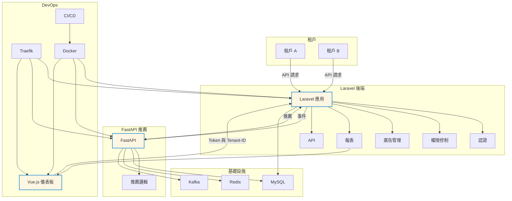

# AdStackX - 模組化廣告平台

AdStackX 是一個專為廣告管理打造的多租戶平台，使用 **Laravel**、**FastAPI** 和 **Vue 3** 構建，支援個人化廣告推薦、即時數據分析、RBAC 權限控制和自動化部署。核心功能包括廣告管理（創建、編輯、投放）、推薦引擎（基於用戶行為）、報表生成（展示、點擊、轉換率）和高效監控（Prometheus + Grafana）。它適合需要多品牌運營和高擴展性的廣告企業，具備 SaaS 潛力。

**注意**：本倉庫（https://github.com/BpsEason/ad-platform.git）僅包含核心程式碼（例如自定義控制器、模型、前端組件）。基本 Laravel 框架程式碼（例如 `app/Models/User.php`、路由檔案）和依賴（PHP、Python、Node.js 模組）需自行新增。請按照下方「初始化 Laravel 專案」和「安裝依賴」步驟完成設置。

## 常見問題解答（FAQ）

以下是一些關於 AdStackX 的常見問題，涵蓋專案概述、技術選型、功能實現、部署流程和開發挑戰，幫助您快速了解並上手！

### 1. 什麼是 AdStackX？它的設計目標是什麼？

**答**：AdStackX 是一個為廣告平台設計的多租戶系統，基於 Laravel（後端）、FastAPI（推薦引擎）和 Vue 3（前端），整合 MySQL、Redis 和 Kafka，提供廣告管理、個人化推薦和即時報表功能。

**設計目標**：
- **多品牌運營**：支援多租戶架構，讓多個廣告客戶（如品牌 A、品牌 B）共用系統，降低運營成本。
- **個人化推薦**：透過 FastAPI 和 Kafka 實現基於用戶行為的廣告推薦。
- **高效監控**：使用 Prometheus 和 Grafana 提供即時性能和資源監控。
- **快速部署**：支援 Docker 和 GitHub Actions，簡化本地開發和生產部署。

**解決的痛點**：
- 傳統廣告系統難以支援多品牌數據隔離。
- 缺乏即時推薦和報表功能。
- 單體應用在高流量場景下的性能瓶頸。
- 部署流程複雜，環境一致性難保證。

### 2. 為什麼選擇 Laravel、FastAPI 和 Vue 3？

**答**：
- **Laravel**：提供強大的 MVC 架構、Eloquent ORM 和 Artisan 工具，適合快速開發廣告管理和 RBAC 邏輯。搭配 `spatie/laravel-permission`，輕鬆實現權限控制。
- **FastAPI**：高性能（基於 Starlette 和 Pydantic），支援自動生成 Swagger 文檔，適合作為推薦引擎處理高併發事件，並方便整合 Python 生態的 AI/ML 服務。
- **Vue 3**：支援響應式前端開發，結合 Vite 提供快速構建和優化的用戶體驗，適合打造現代化廣告管理界面。

### 3. 多租戶架構如何實現？如何保證數據隔離？

**答**：使用 Laravel 的自定義中間件（`SetTenant`）和全局範圍（`TenantScope`）實現多租戶，每個租戶的數據透過 `tenant_id` 字段隔離。MySQL 儲存核心數據，Redis 用於快取，Kafka 處理事件流。Traefik 根據域名（例如 `tenant-a.localhost`）動態路由，確保請求正確分發。

**優勢**：
- **數據安全**：租戶數據隔離，防止交叉訪問。
- **性能優化**：減少查詢中的 `WHERE tenant_id = X`。
- **靈活性**：支援快速新增租戶，適合 SaaS 模式。

### 4. Laravel、FastAPI 和 Vue 3 如何協同工作？FastAPI 的作用是什麼？

**答**：
- **Vue 3 ↔ FastAPI**：前端透過 REST API 與 FastAPI 通訊，獲取廣告數據和推薦結果。
- **FastAPI ↔ Laravel**：FastAPI 作為統一閘道，將請求轉發給 Laravel（透過 HTTP 或內部網路），並注入租戶資訊（`X-Tenant-Id`）。
- **Kafka**：處理即時事件（如點擊、展示），供 FastAPI 的推薦引擎使用。

**FastAPI 的作用**：
- 統一 API 入口，簡化前端與後端通訊。
- 處理 JWT 驗證和速率限制，保護後端。
- 支援事件流處理，與 Kafka 整合，提供即時推薦。

### 5. 專案使用了哪些資料儲存？它們的用途是什麼？

**答**：
- **MySQL**：儲存結構化數據（用戶、廣告、租戶配置），支援關聯查詢。
- **Redis**：用於快取和佇列管理，提升性能。
- **Kafka**：處理即時事件流（點擊、展示），支援推薦和分析。

**選擇原因**：
- MySQL 穩定且支援關聯查詢，適合業務邏輯。
- Redis 提供高效快取和佇列。
- Kafka 確保事件流的高吞吐量和可靠性。

### 6. 廣告管理流程如何實現？如何控制權限？

**答**：廣告管理支援創建、編輯、投放和報表生成：
- **流程**：廣告透過 `AdController` 創建，狀態包括「草稿」、「活躍」和「結束」。
- **權限控制（RBAC）**：使用 `spatie/laravel-permission`，定義角色（`advertiser`、`viewer`）和權限（`create ads`、`view reports`）。`AdPolicy` 檢查操作權限。
- **日誌記錄**：使用 `Spatie\Activitylog` 記錄廣告操作，確保可追溯。

### 7. 如何實現個人化推薦？

**答**：FastAPI 透過 Kafka 消費事件（點擊、展示），結合 Redis 快取和 MySQL 數據，生成推薦：
- **事件處理**：Kafka 主題（`click`、`impression`）記錄用戶行為。
- **推薦邏輯**：FastAPI 的 `/recommend` 端點處理簡單規則或機器學習模型（需自行實現）。
- **快取**：Redis 儲存熱門廣告，降低資料庫負載。

### 8. 報表功能如何實現？

**答**：報表透過 `ReportController` 提供：
- **端點**：`/api/reports/conversions`（轉換率）、`/api/reports/events`（事件統計）。
- **實現**：從 `events` 表按 `tenant_id` 聚合數據，生成即時報表。
- **監控**：Prometheus 記錄報表查詢次數，Grafana 展示趨勢。

### 9. 如何確保 API 安全性和速率限制？

**答**：
- **身份驗證**：Laravel 使用 `Sanctum` 生成和驗證 API Token，FastAPI 使用 JWT。
- **權限控制**：`Spatie\Permission` 實現 RBAC，透過 `AdPolicy` 檢查操作權限。
- **速率限制**：
  - Laravel 使用 `throttle:api` 中間件。
  - FastAPI 使用 `slowapi` 限制全局或端點請求。
- **HTTPS**：Traefik 整合 Let's Encrypt 啟用 TLS。
- **錯誤追蹤**：Sentry 監控 API 錯誤並發送告警。

### 10. CI/CD 流程如何運作？有哪些安全措施？

**答**：
- **CI（持續集成）**：
  - 推送代碼到 `main` 或 `develop` 分支，觸發 GitHub Actions。
  - 安裝依賴（Composer、Pip、NPM），運行測試（PHPUnit、Pytest、Jest）。
  - 構建 Docker 映像，使用 Trivy 掃描漏洞。
- **CD（持續部署）**：
  - CI 成功後，將映像推送到容器註冊表，支援本地或雲端部署。
- **安全措施**：
  - **Trivy**：掃描 Docker 映像漏洞。
  - **Dependabot**：自動檢測依賴漏洞並提交更新 PR。
  - **Secrets 管理**：使用 GitHub Secrets 儲存敏感資訊。

### 11. 租戶初始化如何實現「一鍵化」？

**答**：透過自定義 Artisan 命令 `tenants:create`：
- 創建租戶記錄（MySQL）。
- 初始化租戶上下文，設置角色和權限。
- 通知 FastAPI（透過 Webhook）更新閘道配置。
- 使用單一命令完成設置，簡化操作。

### 12. 專案開發中的主要挑戰是什麼？如何解決？

**答**：
- **挑戰 1：事件流與推薦性能**
  - **問題**：Kafka 事件流的高吞吐量和即時推薦的性能要求。
  - **解決方案**：使用 Kafka 分區提升吞吐量，Redis 快取降低延遲。
- **挑戰 2：多租戶數據隔離**
  - **問題**：確保租戶數據隔離且不影響性能。
  - **解決方案**：`SetTenant` 中間件和 `TenantScope` 確保數據隔離，Traefik 動態路由優化請求分發。
- **挑戰 3：監控與錯誤追蹤**
  - **問題**：多服務環境下的錯誤定位。
  - **解決方案**：Prometheus 和 Grafana 提供即時監控，Sentry 追蹤錯誤。

### 13. 未來如何擴展 AdStackX？

**答**：
- **AI 推薦**：整合協同過濾或深度學習模型，提升推薦精準度。
- **日誌系統**：新增 ELK Stack 集中化日誌管理。
- **雲端部署**：支援 Kubernetes 或 AWS ECS，提升高可用性。
- **分佈式追蹤**：使用 Jaeger/OpenTelemetry 追蹤請求路徑。
- **數據分析**：整合數據湖（如 AWS Redshift）進行跨租戶分析。

## 系統架構

以下是 AdStackX 的系統架構圖，使用中文標籤並優化 Mermaid 格式以確保渲染正確。



**說明**：
- **Traefik**：根據域名路由請求至前端、Laravel 或 FastAPI。
- **Laravel**：處理廣告管理和報表邏輯。
- **FastAPI**：運行推薦引擎，消費 Kafka 事件。
- **監控**：Prometheus 收集指標，Grafana 展示儀表板。

## 環境要求

- **Docker** 和 **Docker Compose**（本地開發）
- **PHP**（v8.1+，Laravel）
- **Python**（v3.9+，FastAPI）
- **Node.js**（v18+，Vue 3）
- **服務**：MySQL（v8.0）、Redis（v6.2）、Kafka（v3.5.1）、Zookeeper（v3.8.3）、Prometheus（v2.47.0）、Grafana（v10.2.2）

## 初始化 Laravel 專案

本倉庫僅包含核心程式碼，需初始化 Laravel 專案並整合：

1. **安裝 Laravel**：
   ```bash
   composer create-project laravel/laravel laravel
   cd laravel
   ```

2. **複製核心程式碼**：
   將倉庫的 `laravel/` 目錄（如 `app/Http/Controllers/AdController.php`）複製到新專案的 `laravel/app/`。

3. **創建路由檔案**：
   在 `laravel/routes/` 創建 `api.php`：
   ```php
   <?php
   use Illuminate\Support\Facades\Route;
   use App\Http\Controllers\AdController;

   Route::middleware(['auth:sanctum', 'tenant'])->group(function () {
       Route::get('/ads', [AdController::class, 'index']);
       Route::post('/ads', [AdController::class, 'store']);
   });
   ```

4. **創建 .env 文件**：
   ```bash
   cp .env.example .env
   ```
   編輯 `.env`，添加以下變數：
   ```env
   APP_NAME=AdStackX
   APP_ENV=local
   APP_KEY=
   APP_DEBUG=true
   APP_URL=http://ad-api.localhost

   DB_CONNECTION=mysql
   DB_HOST=mysql
   DB_PORT=3306
   DB_DATABASE=ad_platform_db
   DB_USERNAME=user
   DB_PASSWORD=secret

   REDIS_HOST=redis
   KAFKA_BROKER=kafka1:9092
   TRAEFIK_API_KEY=your_traefik_key
   SANCTUM_STATEFUL_DOMAINS=localhost,ad-api.localhost,recommender.localhost,frontend.localhost
   SENTRY_DSN=your_sentry_dsn
   ```

## 安裝依賴

需手動創建依賴配置文件並安裝：

### 1. Laravel（PHP 依賴）
編輯 `laravel/composer.json`：
```json
{
    "require": {
        "php": "^8.1",
        "laravel/framework": "^10.0",
        "laravel/sanctum": "^3.2",
        "spatie/laravel-permission": "^5.10",
        "spatie/laravel-activitylog": "^4.7",
        "darkaonline/l5-swagger": "^8.5"
    },
    "require-dev": {
        "phpunit/phpunit": "^10.0"
    }
}
```
安裝：
```bash
cd laravel
composer install
```

### 2. FastAPI（Python 依賴）
創建 `fastapi/requirements.txt`：
```text
fastapi==0.95.0
uvicorn==0.20.0
pydantic==1.10.7
aiokafka==0.8.0
redis==4.5.4
mysql-connector-python==8.0.33
slowapi==0.1.8
sentry-sdk==1.40.0
python-jose[cryptography]==3.3.0
```
安裝：
```bash
cd fastapi
pip install -r requirements.txt
```

### 3. Vue 3（Node.js 依賴）
創建 `frontend/package.json`：
```json
{
    "dependencies": {
        "vue": "^3.2.47",
        "axios": "^1.4.0"
    },
    "devDependencies": {
        "@vitejs/plugin-vue": "^4.0.0",
        "vite": "^4.1.4",
        "jest": "^29.5.0",
        "@testing-library/vue": "^7.0.0"
    },
    "scripts": {
        "dev": "vite",
        "build": "vite build",
        "test": "jest"
    }
}
```
安裝：
```bash
cd frontend
npm install
```

## 安裝步驟

1. **複製專案**：
   ```bash
   git clone https://github.com/BpsEason/ad-platform.git
   cd ad-platform
   ```

2. **初始化 Laravel 專案並複製核心程式碼**：
   見「初始化 Laravel 專案」。

3. **創建 Docker Compose 配置**：
   在根目錄創建 `docker-compose.yml`：
   ```yaml
   version: '3.8'
   services:
     traefik:
       image: traefik:v2.9
       ports:
         - "80:80"
         - "8080:8080"
       volumes:
         - ./traefik.yml:/etc/traefik/traefik.yml
         - /var/run/docker.sock:/var/run/docker.sock
       networks:
         - ad_network
     laravel:
       build: ./laravel
       environment:
         - APP_ENV=local
         - APP_KEY=${APP_KEY}
         - DB_HOST=mysql
         - DB_DATABASE=${DB_DATABASE}
         - DB_USERNAME=${DB_USERNAME}
         - DB_PASSWORD=${DB_PASSWORD}
         - REDIS_HOST=redis
       volumes:
         - ./laravel:/var/www/html
         - ./docker/entrypoint.sh:/entrypoint.sh
       depends_on:
         - mysql
         - redis
       networks:
         - ad_network
       labels:
         - "traefik.http.routers.laravel.rule=Host(`ad-api.localhost`)"
     fastapi:
       build: ./fastapi
       environment:
         - KAFKA_BROKER=${KAFKA_BROKER}
         - REDIS_HOST=redis
         - DB_HOST=mysql
         - DB_NAME=${DB_DATABASE}
         - DB_USER=${DB_USERNAME}
         - DB_PASSWORD=${DB_PASSWORD}
       depends_on:
         - kafka1
         - redis
         - mysql
       networks:
         - ad_network
       labels:
         - "traefik.http.routers.fastapi.rule=Host(`recommender.localhost`)"
     frontend:
       build: ./frontend
       networks:
         - ad_network
       labels:
         - "traefik.http.routers.frontend.rule=Host(`frontend.localhost`)"
     mysql:
       image: mysql:8.0
       environment:
         - MYSQL_ROOT_PASSWORD=${DB_ROOT_PASSWORD}
         - MYSQL_DATABASE=${DB_DATABASE}
         - MYSQL_USER=${DB_USERNAME}
         - MYSQL_PASSWORD=${DB_PASSWORD}
       volumes:
         - mysql_data:/var/lib/mysql
       networks:
         - ad_network
     redis:
       image: redis:6.2
       networks:
         - ad_network
     zookeeper1:
       image: confluentinc/cp-zookeeper:7.3.0
       environment:
         ZOOKEEPER_CLIENT_PORT: 2181
         ZOOKEEPER_TICK_TIME: 2000
       networks:
         - ad_network
     kafka1:
       image: confluentinc/cp-kafka:7.3.0
       depends_on:
         - zookeeper1
       environment:
         KAFKA_BROKER_ID: 1
         KAFKA_ZOOKEEPER_CONNECT: zookeeper1:2181
         KAFKA_ADVERTISED_LISTENERS: PLAINTEXT://kafka1:9092,EXTERNAL://localhost:9094
         KAFKA_LISTENERS: PLAINTEXT://:9092,EXTERNAL://:9094
         KAFKA_OFFSETS_TOPIC_REPLICATION_FACTOR: 1
       ports:
         - "9094:9094"
       networks:
         - ad_network
     prometheus:
       image: prom/prometheus:v2.47.0
       volumes:
         - ./prometheus.yml:/etc/prometheus/prometheus.yml
       ports:
         - "9090:9090"
       networks:
         - ad_network
     grafana:
       image: grafana/grafana:10.2.2
       ports:
         - "3000:3000"
       environment:
         - GF_SECURITY_ADMIN_PASSWORD=admin
       networks:
         - ad_network
   networks:
     ad_network:
       driver: bridge
   volumes:
     mysql_data:
   ```

4. **創建 Traefik 配置**：
   在根目錄創建 `traefik.yml`：
   ```yaml
   http:
     routers:
       api:
         rule: "Host(`traefik.localhost`)"
         service: api@internal
         middlewares:
           - auth
     middlewares:
       auth:
         basicAuth:
           users:
             - "admin:$apr1$your_hashed_password"
   ```

5. **創建 Laravel 入口腳本**：
   在 `docker/` 目錄創建 `entrypoint.sh`：
   ```bash
   #!/bin/bash
   set -e
   if [ "${APP_KEY}" = "your_generated_key" ]; then
     echo "錯誤：APP_KEY 未設置，請運行 'php artisan key:generate'。" >&2
     exit 1
   fi
   php artisan optimize
   php artisan serve --host=0.0.0.0 --port=80
   ```

6. **生成 Laravel 應用程式金鑰**：
   ```bash
   docker-compose run --rm laravel php artisan key:generate --show
   ```
   將生成的 `APP_KEY` 更新到 `.env`。

7. **運行資料庫遷移**：
   ```bash
   docker-compose exec laravel php artisan migrate --force
   ```

8. **更新 RouteServiceProvider**：
   在 `laravel/app/Providers/RouteServiceProvider.php` 的 `boot` 方法添加：
   ```php
   public function boot()
   {
       $this->configureRateLimiting();
       $this->routes(function () {
           Route::middleware('api')
               ->prefix('api')
               ->group(base_path('routes/api.php'));
           Route::middleware(['api', \App\Http\Middleware\SetTenant::class])
               ->prefix('api')
               ->group(base_path('routes/api.php'));
       });
   }
   ```

9. **添加環境變數驗證**：
   在 `laravel/public/index.php` 添加：
   ```php
   require __DIR__.'/../bootstrap/validate_env.php';
   ```
   創建 `laravel/bootstrap/validate_env.php`：
   ```php
   <?php
   if (!env('APP_KEY')) {
       throw new RuntimeException('Application key not set in .env file.');
   }
   ```

## 使用方法

- **前端訪問**：`http://frontend.localhost`（Vue 3）
- **API 閘道**：`http://recommender.localhost/docs`（FastAPI）
- **Laravel 後端**：`http://ad-api.localhost/api`（透過 Traefik 訪問）
- **Prometheus UI**：`http://localhost:9090`
- **Grafana UI**：`http://localhost:3000`（用戶：admin，密碼：admin）

**運行測試**：
- **Laravel**：`docker-compose exec laravel vendor/bin/phpunit`
- **FastAPI**：`docker-compose exec fastapi pytest`
- **Vue 3**：`docker-compose exec frontend npm test`

## 部署

1. **構建並推送 Docker 映像**：
   ```bash
   docker build -t your_registry/adstackx-laravel:latest ./laravel
   docker build -t your_registry/adstackx-fastapi:latest ./fastapi
   docker build -t your_registry/adstackx-frontend:latest ./frontend
   docker push your_registry/adstackx-laravel:latest
   docker push your_registry/adstackx-fastapi:latest
   docker push your_registry/adstackx-frontend:latest
   ```

2. **應用 Docker Compose 配置**：
   ```bash
   docker-compose up --build -d
   ```

## 關鍵程式碼

以下展示 `laravel/app/Http/Controllers/AdController.php` 的核心方法，體現廣告管理和權限控制功能。

### 1. `store()` 方法
處理廣告創建，檢查權限並記錄日誌。

```php
/**
 * 創建新廣告。
 */
public function store(Request $request)
{
    // 檢查用戶是否有創建權限
    $this->authorize('create', \App\Models\Ad::class);

    try {
        // 驗證輸入數據
        $data = $request->validate([
            'name' => 'required|string|max:255',
            'content' => 'required|string',
            'start_time' => 'required|date',
            'end_time' => 'required|date|after:start_time',
        ]) + ['tenant_id' => config('current_tenant_id')];

        // 創建廣告
        $ad = \App\Models\Ad::create($data);

        // 記錄創建日誌
        activity()
            ->performedOn($ad)
            ->causedBy(auth()->user())
            ->event('created')
            ->log('廣告 ' . $ad->name . ' 已創建。');

        // 觸發 Kafka 事件
        event(new \App\Events\AdCreated($ad));

        // 記錄 Prometheus 指標
        \Prometheus\Counter::get('ads_created_total')->inc(['tenant_id' => tenancy()->tenant->id]);

        return response()->json(['message' => '廣告創建成功', 'ad' => $ad], 201);
    } catch (\Exception $e) {
        return response()->json(['error' => '創建廣告失敗: ' . $e->getMessage()], 400);
    }
}
```

**價值**：
- **權限控制**：RBAC 確保只有授權用戶可創建廣告。
- **事件驅動**：Kafka 事件通知推薦引擎。
- **可追溯性**：日誌記錄便於審計。
- **監控**：Prometheus 追蹤創建次數。

### 2. `index()` 方法
獲取租戶的廣告列表。

```php
/**
 * 獲取廣告列表。
 */
public function index()
{
    $ads = \App\Models\Ad::where('tenant_id', config('current_tenant_id'))->get();
    return response()->json($ads);
}
```

**價值**：
- **數據隔離**：透過 `TenantScope` 自動過濾租戶數據。
- **簡單高效**：直接返回 JSON 響應，適合前端渲染。

## 貢獻

歡迎提交 Pull Request 或 Issue！步驟：
1. Fork 倉庫。
2. 創建特性分支（`git checkout -b feature/YourFeature`）。
3. 提交更改（`git commit -m 'Add YourFeature'`）。
4. 推送分支（`git push origin feature/YourFeature`）。
5. 創建 Pull Request。

## 授權

採用 MIT 授權，詳見 [LICENSE](LICENSE) 文件。
